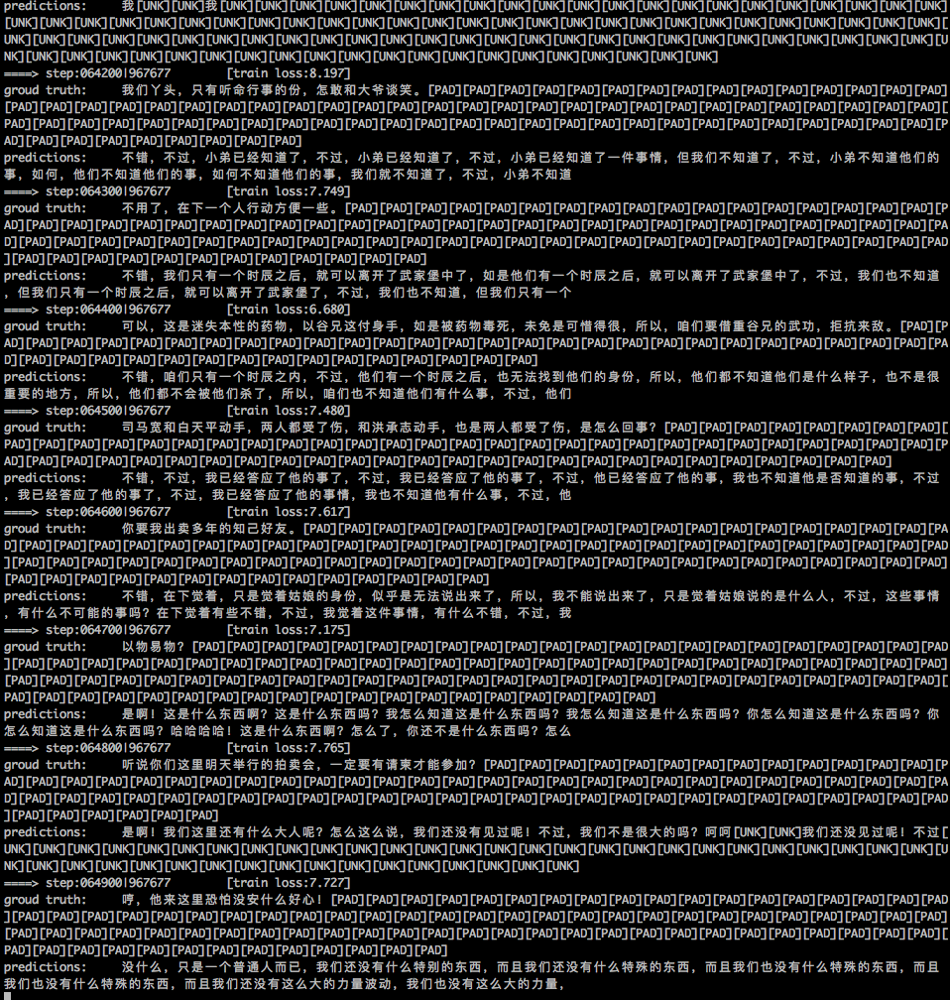

# chat project 

## dataset
1. 数据来自武侠小说中的对话，目前只是抽取了其中带有问答的上下句。对话数量为774142，其中上句的最大长度118， 下句的最大长度98
2. 可以通过***```test_data.ipynb```***查看

## model
1. 采用***```bert encoder + seq2seq decoder```***
2. 可以通过***```test_model.ipynb```***查看

## parameters
1. 通过***```params.ini```***设置

## pretrained bert model
1. 下载bert官方的中文模型，解压，并在***```params.ini```***中配置其路径

## 训练效果
如图是运行了不到一个epoch的效果，持续更新中。。。
